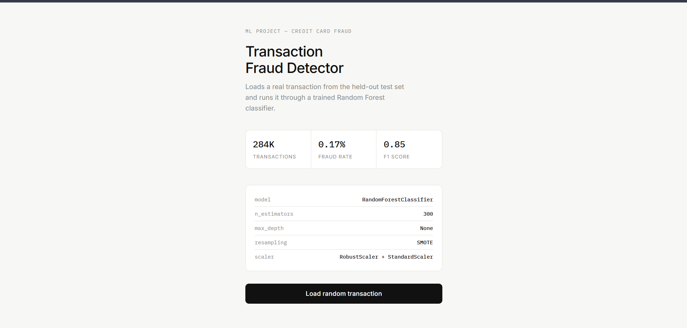
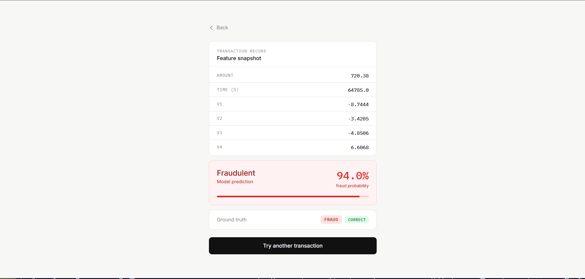
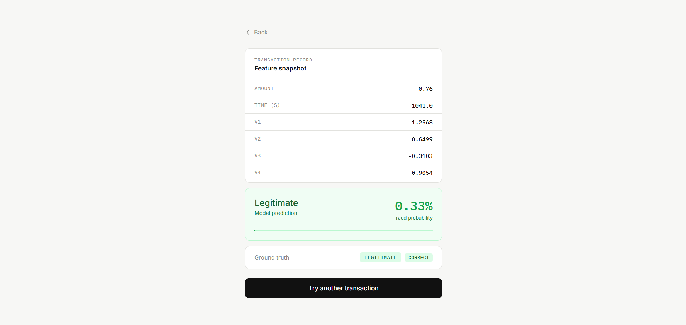

<div align="center">

# 💳 Credit Card Fraud Detection

[](http://credit-card-fraud-detection-env.eba-yyzs69mt.eu-north-1.elasticbeanstalk.com/)
[](https://hub.docker.com/)
[](https://www.python.org/)
[](https://flask.palletsprojects.com/)
[](https://scikit-learn.org/)

An end-to-end machine learning pipeline that detects fraudulent credit card transactions in real time. Trained on 284K anonymized transactions with a 0.17% fraud rate, the system handles severe class imbalance using SMOTE and achieves an **F1 score of 0.85** with a Random Forest classifier.

</div>

---

## 🖥️ App Demo

| Home Screen | Fraud Detected | Legitimate Transaction |
|:-----------:|:--------------:|:---------------------:|
|  |  |  |

> The app loads a real transaction from the held-out test set, runs it through the trained model, and displays the fraud probability alongside the ground truth label — so you can see whether the model got it right.

---

## 🧠 How It Works

```
Raw CSV Data
     │
     ▼
Data Ingestion ──► Deduplication ──► Train/Test Split (80/20)
     │
     ▼
Data Transformation
     ├── RobustScaler  ──► Amount
     ├── StandardScaler ──► Time
     └── SMOTE  ──► Oversample minority (fraud) class on train set
     │
     ▼
Model Training ──► GridSearchCV across 8 models ──► Best model saved
     │
     ▼
Prediction Pipeline ──► Load preprocessor + model ──► Predict + Probability
     │
     ▼
Flask App ──► Random sample from test set ──► Display result
```

---

## 📊 Model Comparison

8 classifiers were trained with GridSearchCV and evaluated on F1 score (chosen over accuracy due to severe class imbalance):

| Model | Notes |
|-------|-------|
| Logistic Regression | Baseline linear model |
| Decision Tree | Fast, interpretable |
| **Random Forest ✅** | **Best performer — selected as final model** |
| Gradient Boosting | Strong but slow to train |
| AdaBoost | Sensitive to noise in imbalanced data |
| Naive Bayes | Fast but assumes feature independence |
| XGBoost | Close second to Random Forest |
| CatBoost | Strong, handles categoricals natively |

**Final Model: RandomForestClassifier**
```
n_estimators : 300
max_depth    : None
resampling   : SMOTE
scaler       : RobustScaler (Amount) + StandardScaler (Time)
F1 Score     : 0.85
```

---

## 🗂️ Project Structure

```
credit-card-fraud-detection/
├── artifacts/                  # Saved model, preprocessor, datasets
│   ├── model.pkl
│   ├── preprocessor.pkl
│   └── test_small.csv
├── notebooks/                  # EDA and model training experiments
│   ├── EDA.ipynb
│   └── Model_training.ipynb
├── src/
│   ├── components/
│   │   ├── data_ingestion.py       # Load, deduplicate, split data
│   │   ├── data_transformation.py  # Scale + SMOTE pipeline
│   │   └── model_training.py       # GridSearchCV across 8 models
│   ├── pipeline/
│   │   ├── predict_pipeline.py     # Inference logic
│   │   └── train_pipeline.py
│   ├── exception.py
│   ├── logger.py
│   └── utils.py
├── templates/                  # Flask HTML templates
├── .ebextensions/              # AWS Elastic Beanstalk config
├── application.py              # Flask app entry point
├── Dockerfile
├── requirements.txt
└── setup.py
```

---

## 🚀 Run Locally

### Option 1 — Docker (recommended)

```bash
docker pull sami1001/credit-card-fraud-detection
docker run -p 5000:5000 sami1001/credit-card-fraud-detection
```

Then open [http://localhost:5000](http://localhost:5000)

### Option 2 — Python

```bash
git clone https://github.com/sleepy-kittens-404/credit-card-fraud-detection.git
cd credit-card-fraud-detection
pip install -r requirements.txt
python application.py
```

---

## 🛠️ Tech Stack

| Layer | Technology |
|-------|------------|
| Language | Python 3.11 |
| ML | scikit-learn, XGBoost, CatBoost |
| Imbalanced Data | imbalanced-learn (SMOTE) |
| Web Framework | Flask |
| Containerization | Docker |
| CI/CD | AWS CodePipeline |
| Deployment | AWS Elastic Beanstalk (EC2) |
| Serialization | dill |

---

## 📁 Dataset

[Kaggle — Credit Card Fraud Detection](https://www.kaggle.com/datasets/mlg-ulb/creditcardfraud)

- 284,807 transactions over 2 days
- 492 fraud cases (0.17% of all transactions)
- Features V1–V28 are PCA-transformed for anonymization
- Only `Time` and `Amount` are original features

---

## 👤 Author

**Muhammad Sami**
[](https://github.com/sleepy-kittens-404)
[](https://linkedin.com/in/muhammad-sami-7ba422395)